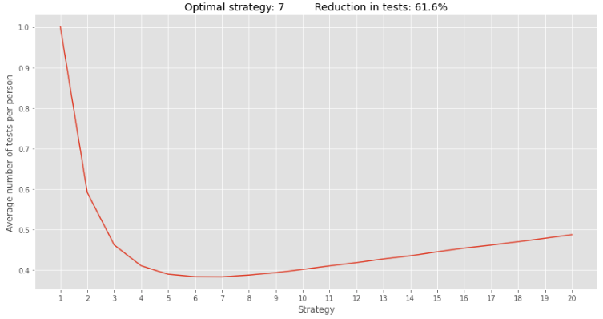
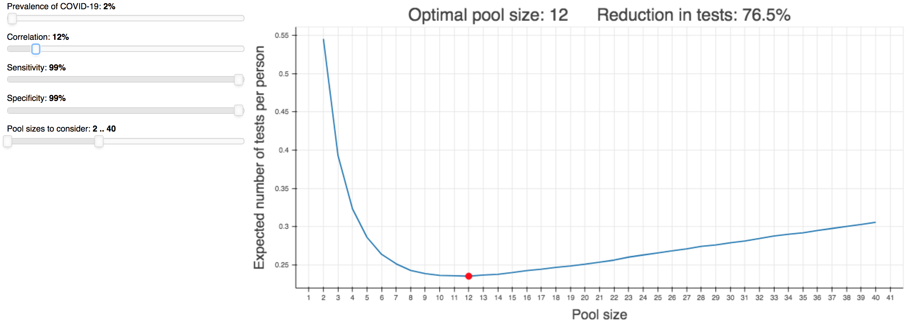

# PooledTesting

PooledTesting is a Python library for simulating various [pooled testing](https://medium.com/@quantresearcher/how-to-test-a-million-people-for-covid-19-without-a-million-test-kits-8e501ba474bc) strategies for COVID-19. It can be used by researchers to determine the expected number of tests required for a given strategy and thus be used to solve for optimal testing configurations such as the pool size to employ.

PooledTesting was designed with two main objectives in mind:
* **fast execution:** strategies are implemented using vectorized NumPy operations and multiple strategies are run in parallel
* **fast extensibility:** custom strategies that utilize heterogeneous estimates for the infection probabilities and correlation structure (perhaps generated by a machine learning model) can be developed using only a few lines of code


## Usage

Running a simulation involves three steps. Here is an example of running a two-stage hierarchical testing strategy with pool sizes from 1 to 20.

```python
import pooledtesting as pt

# 1. Create a PopulationDistribution with the desired characteristics
population_distribution = pt.PopulationDistribution(prevalence = 0.05,
                                                    correlation = 0.1,
                                                    population = 500,
                                                    num_samples = 10000)    

# 2. Create a list of TestingStrategy instances
test = pt.Test(sensitivity = 1, specificity = 1)
strategies = [pt.TwoStageTesting(test = test, pool_size = pool_size)
              for pool_size
              in range(1, 21)]

# 3. Create a Simulator that takes the TestingStrategy instances and runs them on the given PopulationDistribution
simulator = pt.Simulator(population_distribution = population_distribution,
                         strategies = strategies)
simulator.run()
simulator.plot()
```



In this case, the optimal pool size is 7 and this leads to a reduction of more than 60% in the number of tests compared to when everyone is tested individually. For a more in-depth discussion of the steps involved, check out this [notebook](simulator/example.ipynb).

## Raison d'être

In order to facilitate understanding of the value of pooled testing and the relative importance of the factors that impact its value, an [app](http://pooledtesting2.herokuapp.com/) has been developed that enables users to see how different values for the prevalence, correlation, etc affect the optimal pool size in two-stage hierarchical testing.



To view the app locally from a Bokeh server, run the following command in a terminal:

    bokeh serve --show evangelist

## Challenge

For an office of 9 people where the probability of each person being infected is given by

    [0.01, 0.02, 0.03, 0.04, 0.31, 0.32, 0.33, 0.8, 0.9]

and where the correlations of being infected is given by

    [[1. , 0.2, 0.2, 0.2, 0. , 0. , 0. , 0. , 0. ],
     [0.2, 1. , 0.2, 0.2, 0. , 0. , 0. , 0. , 0. ],
     [0.2, 0.2, 1. , 0.2, 0. , 0. , 0. , 0. , 0. ],
     [0.2, 0.2, 0.2, 1. , 0. , 0. , 0. , 0. , 0. ],
     [0. , 0. , 0. , 0. , 1. , 0.9, 0.9, 0. , 0. ],
     [0. , 0. , 0. , 0. , 0.9, 1. , 0.9, 0. , 0. ],
     [0. , 0. , 0. , 0. , 0.9, 0.9, 1. , 0. , 0. ],
     [0. , 0. , 0. , 0. , 0. , 0. , 0. , 1. , 0.7],
     [0. , 0. , 0. , 0. , 0. , 0. , 0. , 0.7, 1. ]]

devise a testing strategy (assuming the diagnostic test has perfect sensitivity and specificity) that will reduce the expected number of tests by at least 31% compared to when everyone is tested individually.