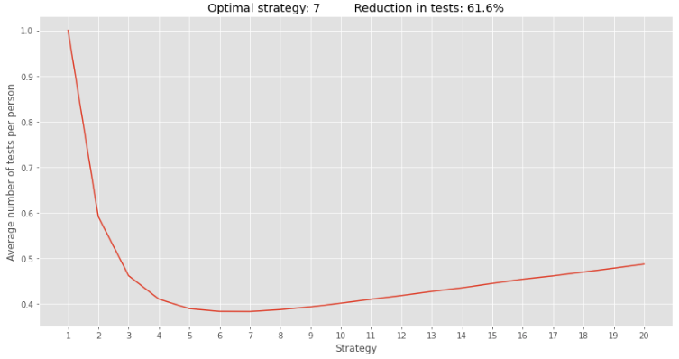
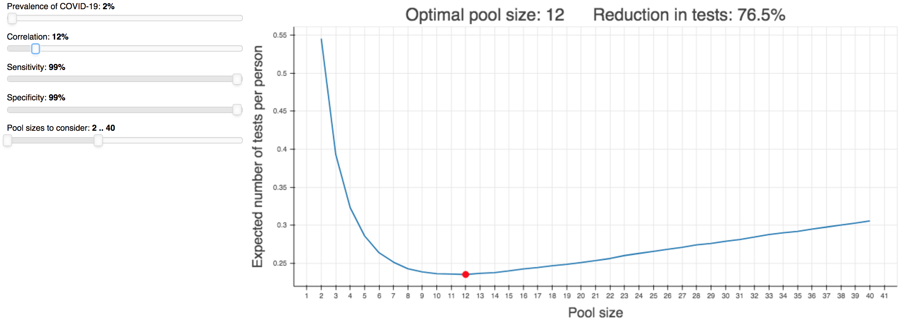

# PooledTesting

PooledTesting is a Python library for simulating various pooled testing strategies for COVID-19. It can be used by researchers to determine the expected number of tests required for a given strategy and thus be used to solve for optimal testing configurations such as the pool size to employ.

PooledTesting was designed with two main objectives in mind:
* **fast execution:** strategies are implemented using vectorized NumPy operations and multiple strategies are run in parallel
* **fast extensibility:** custom strategies that utilize heterogeneous estimates for the infection probabilities and correlation structure (perhaps generated by a machine learning model) can be developed using only a few lines of code


## Usage

Running a simulation involves three steps. Here is an example of running a two-stage hierarchical testing strategy with pool sizes from 1 to 20.

```python
import pooledtesting as pt

# 1. Create a PopulationDistribution with the desired characteristics
population_distribution = pt.PopulationDistribution(prevalence = 0.05,
                                                    correlation = 0.1,
                                                    population = 500,
                                                    num_samples = 10000)    

# 2. Create a list of TestingStrategy instances
test = pt.Test(sensitivity = 1, specificity = 1)
strategies = [pt.TwoStageTesting(test = test, pool_size = pool_size)
              for pool_size
              in range(1, 21)]

# 3. Create a Simulator that takes the TestingStrategy instances and runs them on the given PopulationDistribution
simulator = pt.Simulator(population_distribution = population_distribution,
                         strategies = strategies)
simulator.run()
simulator.plot()
```



We can see in this case that the optimal pool size is 6 and that this leads to a reduction in the number of tests by almost 62% compared to when everyone is tested individually.

## Raison d'être

In order to facilitate understanding of the value of pooled testing and the relative importance of the factors that impact its value, we have developed an app (www.heroku.com/TODO) that enables users to see how different values for the prevalence, correlation, etc affect the optimal pool size in two-stage hierarchical testing.



To view the app locally from a Bokeh server, run the following command in a terminal:

    bokeh serve --show evangelist